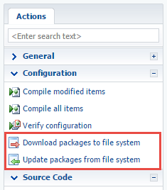
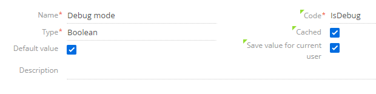

[](https://github.com/sindresorhus/awesome#readme)
# Creatio Guided Learning Dec 18-20, 2019  
This is a training project for the Guided Learning class of Dec 17-20, 2019

## Agenda
- Convert Creatio to development in FileSystem Mode
- Configure Clio (restore NuGet packages)
- Configure NLog
- Set first Breakpoint and make log entry

### Convert Creatio to development in FileSystem Mode. 
- Update [AppPath]\web.config file
```xml
<fileDesignMode enabled="true"/>
<add key="UseStaticFileContent" value="false" />
```
- Download packages to file system <br/>


- Enable Debugging mode for client side source code. Change SystemSetting Debug mode (code: IsDebug) to true<br/>


- [Academy Article](https://academy.creatio.com/documents/technic-sdk/7-15/introduction-9) - Enable File System Mode
- [IsDebug](https://academy.creatio.com/documents/technic-sdk/7-15/isdebug-mode) - Used to get additional debugging info.

### Configure Custom Logging with NLog
To Configure custom logging **update nlog.config** and **nlog.targets.config**. Both files are located in [AppPath]\Terrasoft.WebApp

Add the following to **nlog.config** file:
```xml
<logger name="GuidedLearningLogger" writeTo="GuidedLearningAppender" minlevel="Info" final="true" />
```

Add the following to the **nlog.target.config** file
```xml
<target name="GuidedLearningAppender" xsi:type="File"
	layout="${Date} [${ThreadIdOrName}] ${uppercase:${level}} ${UserName} ${MethodName} - ${Message}"
	fileName="${LogDir}/${LogDay}/GuidedLearning.log" />
```
- [Logging](https://academy.creatio.com/documents/technic-sdk/7-15/logging-creatio-nlog) - Logging

### Set First Break Point
- Create EntityNameEventListener Class and set a breakpoint anywhere inside onSaved method.

```C#
using global::Common.Logging;
using Terrasoft.Core;
using Terrasoft.Core.Entities;
using Terrasoft.Core.Entities.Events;

namespace GuidedLearningClio.Files.cs.el
{
    /// <summary>
    /// Listener for 'EntityName' entity events.
    /// </summary>
    /// <seealso cref="Terrasoft.Core.Entities.Events.BaseEntityEventListener" />
    [EntityEventListener(SchemaName = "Contact")]
    class EntityNameEventListener : BaseEntityEventListener
    {
        private static readonly ILog _log = LogManager.GetLogger("GuidedLearningLogger");
        public override void OnSaved(object sender, EntityAfterEventArgs e)
        {
            base.OnSaved(sender, e);
            Entity entity = (Entity)sender;
            UserConnection userConnection = entity.UserConnection;
            
            string message = $"Changing name for {entity.GetTypedColumnValue<string>("Name")}";
            _log.Info(message);
        }
    }
}
```


## Tools
- [Clio](https://github.com/Advance-Technologies-Foundation/clio) - CLI Library to create packages.
- [Bpmonline.SDK](https://www.nuget.org/packages/BpmonlineSDK/) - Provides project template for development code for bpm'online platform.

## Documentation
- [Creatio](https://academy.creatio.com/documents/technic-sdk/7-15/creatio-development-guide) - Creatio Development Guide
- [Clio](https://github.com/Advance-Technologies-Foundation/clio/blob/master/README.md) - Clio

## Instructor
<a href="mailto:k.krylov@creatio.com?subject=Guided%20Learning%20Dec%2017-20,%202019">Kirill Krylov, CPA</a><br />
Direct Line: +1(617)765-7997 x.2134

